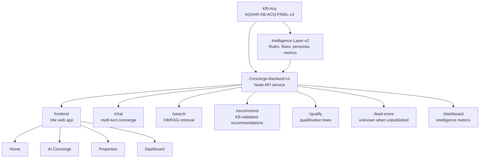

# Aqaar AI Concierge

Aqaar AI Concierge is a data-grounded real estate concierge repository built around four production layers: a verified knowledge acquisition package, a strict intelligence layer, a backend API service, and an API-driven frontend experience. The system is designed to answer, qualify, search, recommend, display, and report only from the approved Aqaar knowledge base and intelligence files.

Missing or unpublished data is represented as `unknown` in backend responses and as `Contact Aqaar for details.` in frontend UI surfaces.

## Features

- Official Aqaar knowledge base package with CSV, JSON, RAG, audit, source, asset, and report files.
- Strict intelligence layer derived from `AQAAR-KB-ACQ-FINAL-v3`.
- Backend APIs for chat, search, recommendations, qualification, lead scoring, and dashboard metrics.
- Existing Vite frontend with Home, AI Concierge, Properties, Dashboard, property cards, enquiry modal, charts, lead table, downloads, and responsive layout.
- RAG-style lexical retrieval over KB project records and RAG chunks.
- Source attribution returned where KB records provide source fields.
- Context memory for multi-turn chat sessions.
- Buy, Rent, Invest, and Commercial intent support from the intelligence layer.
- Lead capture for user-provided name, phone, and email.
- Validation reports and automated backend tests.

## Repository Structure

```text
aqaar/
├── KB-Acq/
│   ├── csv/
│   ├── json/
│   ├── rag/
│   ├── reports/
│   ├── assets/
│   ├── scripts/
│   ├── docs/
│   └── AQAAR-KB-ACQ-FINAL-v3.zip
├── Intelligence-Layer-v2/
│   ├── csv/
│   ├── json/
│   ├── reports/
│   ├── retrieval_test_queries.json
│   └── AQAAR-INTELLIGENCE-LAYER-v2.zip
├── Concierge-Backend-v1/
│   ├── src/
│   ├── tests/
│   ├── scripts/
│   ├── reports/
│   ├── package.json
│   └── AQAAR-CONCIERGE-BACKEND-v1.zip
├── frontend/
│   ├── public/
│   ├── src/
│   │   ├── components/
│   │   ├── pages/
│   │   ├── styles/
│   │   └── api.js
│   ├── dist/
│   ├── package.json
│   └── vite.config.js
├── Aqaar-Frontend-v1/
│   └── archived static frontend package
└── README.md
```

## Architecture



## API List

The backend service is located in `Concierge-Backend-v1`.

- `POST /chat` - Multi-turn concierge endpoint with intent detection, memory, retrieval, recommendations, qualification, and lead capture.
- `POST /recommend` - Returns recommendations from the intelligence package and validates referenced projects against the KB.
- `POST /qualify` - Returns qualification questions and next steps from the intelligence layer.
- `POST /lead-score` - Returns `unknown` score and grade because scoring weights are not published in the current intelligence package.
- `GET|POST /dashboard` - Returns dashboard metrics from `Intelligence-Layer-v2/csv/dashboard_metrics.csv`.
- `GET|POST /search` - Searches KB project records and RAG chunks with source attribution.

## Tech Stack

- Node.js
- Native Node HTTP server
- Native Node test runner
- Vite frontend
- Browser-native JavaScript modules
- Chart.js loaded by the frontend page
- CSV, JSON, JSONL, Markdown
- PowerShell-compatible run commands
- No external runtime data sources

## Folder Descriptions

### KB-Acq

The knowledge acquisition package. It contains the final Aqaar KB source of truth, including project data, inventory, amenities, locations, assets, FAQs, source audit records, RAG chunks, reports, and package zips.

Primary package:

- `KB-Acq/AQAAR-KB-ACQ-FINAL-v3.zip`

### Intelligence-Layer-v2

The strict intelligence layer derived from `AQAAR-KB-ACQ-FINAL-v3`. It includes intent rules, personas, qualification trees, recommendation records, conversation flows, dashboard metrics, and validation reports.

Primary package:

- `Intelligence-Layer-v2/AQAAR-INTELLIGENCE-LAYER-v2.zip`

### Concierge-Backend-v1

The backend API service. It reads from `KB-Acq` and `Intelligence-Layer-v2` at runtime and does not modify either package.

Primary package:

- `Concierge-Backend-v1/AQAAR-CONCIERGE-BACKEND-v1.zip`

### frontend

The active Aqaar frontend app. It is a Vite single-page application with Home, AI Concierge, Properties, and Dashboard routes.

Frontend capabilities:

- Home page with Aqaar styling and API-backed project counts.
- AI Concierge chat with Buy, Rent, Invest, and Commercial flows.
- Properties page with partial search helpers such as `aj`, `mawjan`, `dusit`, and `2 bedroom`.
- Recommendation cards populated from backend API data.
- Enquiry modal with lead capture, toast notifications, and post-submit download action.
- Admin dashboard with API-backed metrics, charts, lead table, and CSV export.
- Mobile responsive layout verified at a 390px viewport.

The frontend proxies `/api/*` requests to the backend service through Vite.

Frontend screenshots placeholder:

- `docs/screenshots/home.png`
- `docs/screenshots/concierge.png`
- `docs/screenshots/properties.png`
- `docs/screenshots/dashboard.png`

## Setup Instructions

1. Install Node.js 18 or newer.
2. Clone the repository.
3. Open a terminal in the repository root.
4. Run backend commands from `Concierge-Backend-v1`.
5. Run frontend commands from `frontend`.

Backend setup:

```powershell
cd Concierge-Backend-v1
npm test
npm run validate
npm start
```

The backend defaults to:

```text
http://localhost:8080
```

Frontend setup:

```powershell
cd frontend
npm install
npm run build
npm run dev -- --host 127.0.0.1 --port 6200
```

The verified local frontend URL is:

```text
http://127.0.0.1:6200
```

Optional backend environment variables:

```powershell
$env:PORT="8080"
$env:AQAAR_KB_ROOT="C:\path\to\aqaar\KB-Acq"
$env:AQAAR_INTELLIGENCE_ROOT="C:\path\to\aqaar\Intelligence-Layer-v2"
```

## Run Commands

From `Concierge-Backend-v1`:

```powershell
npm test
npm run validate
npm start
```

From `frontend`:

```powershell
npm install
npm run build
npm run dev -- --host 127.0.0.1 --port 6200
```

Example API call:

```powershell
Invoke-RestMethod `
  -Method Post `
  -Uri http://localhost:8080/chat `
  -ContentType "application/json" `
  -Body '{"session_id":"demo","message":"I want to buy a waterfront property"}'
```

## Validation Status

Current backend validation status: `PASS`

Latest validated backend checks:

- KB project records loaded: 141
- KB inventory records loaded: 153
- RAG chunks loaded: 239
- Intelligence recommendation rules loaded: 5
- Intent records loaded: 4
- Dashboard metrics loaded: 7
- Recommendation project references validate against KB: PASS
- Unpublished lead scoring remains `unknown`: PASS
- Runtime data is not fabricated: PASS

Latest backend test status:

- Suites: 1
- Tests: 6
- Passed: 6
- Failed: 0

Latest frontend verification status:

- `npm install`: PASS
- `npm run build`: PASS
- `npm run dev`: PASS at `http://127.0.0.1:6200`
- Manual flow verification: PASS
- Verified pages: Home, AI Concierge, Properties, Dashboard
- Verified UI: Buy/Rent/Invest/Commercial flows, property search, recommendation cards, enquiry modal, downloads, dashboard charts, lead table, mobile responsiveness
- `frontend` has no npm test script; manual flow checks were used for frontend testing.

## Current Progress

- KB acquisition package completed through `AQAAR-KB-ACQ-FINAL-v3`.
- Intelligence layer rebuilt as strict KB-only `AQAAR-INTELLIGENCE-LAYER-v2`.
- Concierge backend v1 completed with six API endpoints.
- Backend package generated as `AQAAR-CONCIERGE-BACKEND-v1.zip`.
- Automated tests and validation reports are included in the backend package.
- Existing `frontend/` Vite app is connected to backend APIs and verified locally.

## Roadmap

- Add authenticated lead persistence once an approved storage target is selected.
- Add production deployment configuration.
- Add observability for API request logs, validation failures, and retrieval coverage.
- Add approved CRM or sales handoff integration.
- Add production hosting configuration for the existing frontend.
- Add final screenshot captures under `docs/screenshots/`.
- Expand the KB and intelligence layer only from approved Aqaar sources.
