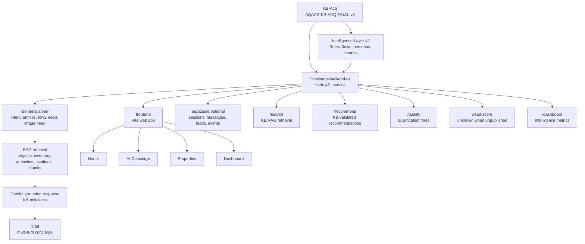
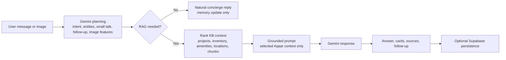

# Aqaar AI Concierge

Aqaar AI Concierge is a data-grounded real estate concierge repository built around four production layers: a verified knowledge acquisition package, a strict intelligence layer, a backend API service, and an API-driven frontend experience. The system is designed to answer, qualify, search, recommend, display, and report only from the approved Aqaar knowledge base and intelligence files.

Missing or unpublished data is represented as `unknown` in data objects and as grounded user-facing copy such as `This is not published in the verified Aqaar KB.` or `Available on enquiry`.

## Features

- Official Aqaar knowledge base package with CSV, JSON, RAG, audit, source, asset, and report files.
- Strict intelligence layer derived from `AQAAR-KB-ACQ-FINAL-v3`.
- Backend APIs for chat, search, recommendations, qualification, lead scoring, and dashboard metrics.
- Existing Vite frontend with Home, AI Concierge, Properties, Dashboard, property cards, enquiry modal, charts, lead table, downloads, and responsive layout.
- AI-first Gemini orchestration for `/chat`, including planning, intent/entity extraction, follow-up detection, and image understanding.
- RAG retrieval over KB projects, inventory, amenities, locations, assets, and RAG chunks.
- Gemini grounded generation using only retrieved Aqaar KB context.
- Optional Supabase persistence for chat history, memory, lead details, saved properties, and dashboard analytics.
- Source attribution returned where KB records provide source fields.
- Context memory for multi-turn chat sessions.
- Buy, Rent, Invest, and Commercial intent support from the intelligence layer.
- Lead capture for user-provided name, phone, and email.
- Validation reports and automated backend tests.

## Repository Structure

```text
aqaar/
├── KB-Acq/
│   ├── csv/
│   ├── json/
│   ├── rag/
│   ├── reports/
│   ├── assets/
│   ├── scripts/
│   ├── docs/
│   └── AQAAR-KB-ACQ-FINAL-v3.zip
├── Intelligence-Layer-v2/
│   ├── csv/
│   ├── json/
│   ├── reports/
│   ├── retrieval_test_queries.json
│   └── AQAAR-INTELLIGENCE-LAYER-v2.zip
├── Concierge-Backend-v1/
│   ├── src/
│   ├── tests/
│   ├── scripts/
│   ├── reports/
│   ├── package.json
│   └── AQAAR-CONCIERGE-BACKEND-v1.zip
├── frontend/
│   ├── public/
│   ├── src/
│   │   ├── components/
│   │   ├── pages/
│   │   ├── styles/
│   │   └── api.js
│   ├── dist/
│   ├── package.json
│   └── vite.config.js
├── Aqaar-Frontend-v1/
│   └── archived static frontend package
└── README.md
```

## Architecture



## API List

The backend service is located in `Concierge-Backend-v1`.

- `POST /chat` - AI-first multi-turn concierge endpoint with Gemini planning, memory, optional image analysis, RAG retrieval, grounded Gemini response generation, recommendations, qualification, source labels, lead capture, and optional Supabase persistence.
- `POST /recommend` - Returns recommendations from the intelligence package and validates referenced projects against the KB.
- `POST /qualify` - Returns qualification questions and next steps from the intelligence layer.
- `POST /lead-score` - Returns `unknown` score and grade because scoring weights are not published in the current intelligence package.
- `GET|POST /dashboard` - Returns Supabase analytics when configured, with fallback metrics from `Intelligence-Layer-v2/csv/dashboard_metrics.csv`.
- `GET|POST /search` - Searches KB project records and RAG chunks with source attribution.

## Tech Stack

- Node.js
- Gemini API, server-side only through `GEMINI_API_KEY`
- Supabase REST API, optional through `SUPABASE_URL` and `SUPABASE_ANON_KEY`
- Native Node HTTP server
- Native Node test runner
- Vite frontend
- Browser-native JavaScript modules
- Chart.js loaded by the frontend page
- CSV, JSON, JSONL, Markdown
- PowerShell-compatible run commands
- No external property data sources

## Folder Descriptions

### KB-Acq

The knowledge acquisition package. It contains the final Aqaar KB source of truth, including project data, inventory, amenities, locations, assets, FAQs, source audit records, RAG chunks, reports, and package zips.

Primary package:

- `KB-Acq/AQAAR-KB-ACQ-FINAL-v3.zip`

### Intelligence-Layer-v2

The strict intelligence layer derived from `AQAAR-KB-ACQ-FINAL-v3`. It includes intent rules, personas, qualification trees, recommendation records, conversation flows, dashboard metrics, and validation reports.

Primary package:

- `Intelligence-Layer-v2/AQAAR-INTELLIGENCE-LAYER-v2.zip`

### Concierge-Backend-v1

The backend API service. It reads from `KB-Acq` and `Intelligence-Layer-v2` at runtime and does not modify either package.

Primary package:

- `Concierge-Backend-v1/AQAAR-CONCIERGE-BACKEND-v1.zip`

### frontend

The active Aqaar frontend app. It is a Vite single-page application with Home, AI Concierge, Properties, and Dashboard routes.

Frontend capabilities:

- Home page with Aqaar styling and API-backed project counts.
- AI Concierge chat with Buy, Rent, Invest, and Commercial flows.
- Properties page with partial search helpers such as `aj`, `mawjan`, `dusit`, and `2 bedroom`.
- Recommendation cards populated from backend API data.
- Enquiry modal with lead capture, toast notifications, and post-submit download action.
- Admin dashboard with API-backed metrics, charts, lead table, and CSV export.
- Mobile responsive layout verified at a 390px viewport.

The frontend proxies `/api/*` requests to the backend service through Vite.

Frontend screenshots placeholder:

- `docs/screenshots/home.png`
- `docs/screenshots/concierge.png`
- `docs/screenshots/properties.png`
- `docs/screenshots/dashboard.png`

## Setup Instructions

1. Install Node.js 18 or newer.
2. Clone the repository.
3. Open a terminal in the repository root.
4. Run backend commands from `Concierge-Backend-v1`.
5. Run frontend commands from `frontend`.

Backend setup:

```powershell
cd Concierge-Backend-v1
npm test
npm run validate
npm start
```

The backend defaults to:

```text
http://localhost:8080
```

Frontend setup:

```powershell
cd frontend
npm install
npm run build
npm run dev -- --host 127.0.0.1 --port 6200
```

The verified local frontend URL is:

```text
http://127.0.0.1:6200
```

Optional backend environment variables:

```powershell
$env:PORT="8080"
$env:GEMINI_API_KEY="your-gemini-api-key"
$env:GEMINI_MODEL="gemini-2.5-flash"
$env:SUPABASE_URL="https://YOUR_PROJECT_ID.supabase.co"
$env:SUPABASE_ANON_KEY="your-supabase-anon-key"
$env:AQAAR_KB_ROOT="C:\path\to\aqaar\KB-Acq"
$env:AQAAR_INTELLIGENCE_ROOT="C:\path\to\aqaar\Intelligence-Layer-v2"
```

Supabase setup:

```powershell
# Run database/supabase_schema.sql in the Supabase SQL editor.
# If Supabase variables are not configured or Supabase is unavailable,
# the backend continues with in-memory chat sessions and intelligence seed dashboard data.
```

## LLM And RAG

The AI Concierge uses Gemini Flash from the backend only. The frontend never receives or stores the API key.

Configured model:

```text
GEMINI_MODEL, for example gemini-2.5-flash
```

AI flow:



Grounding rules:

- Gemini first plans the request, including whether it is small talk, a follow-up, a property request, or an image-led search.
- RAG runs only for property-related requests or image searches that need verified Aqaar context.
- Gemini receives only selected Aqaar KB/RAG context, conversation memory, image-derived search features when present, and validated project cards.
- Gemini is instructed not to invent projects, prices, ROI, payment plans, amenities, locations, dates, or URLs.
- If the requested fact is missing from the retrieved KB context, the answer must say: `This is not published in the verified Aqaar KB.`
- Raw source URLs are not displayed in chat; the response returns clean labels such as `Mawjan brochure`, `Dusit Thani brochure`, or `Aqaar official KB`.
- When `GEMINI_API_KEY` is not set, `/chat` keeps working through the deterministic KB-only fallback and returns `llm.used: false`.

Conversation memory stores the user's name, phone, email, purpose, property type, bedrooms, budget, location, project, timeline, and investment goal in the active session. Short follow-up replies such as `2`, `Ajman`, `under 90k`, `show another one`, or `similar` are interpreted against that session memory.

Image search accepts base64 image payloads in `/chat`. Gemini Vision extracts property-style features such as apartment, villa, commercial use, architecture, luxury level, colour palette, garden, pool, and waterfront cues. Those features are converted into a semantic Aqaar KB search, and recommendations explain why the verified Aqaar properties are visually similar.

## Supabase

Supabase is optional and production-oriented. The backend reads these environment variables:

```text
SUPABASE_URL
SUPABASE_ANON_KEY
```

Schema file:

- `database/supabase_schema.sql`

Tables:

- `chat_sessions`
- `chat_messages`
- `leads`
- `saved_properties`
- `dashboard_events`

Stored data:

- Chat history and assistant responses.
- Conversation memory.
- Lead details captured in chat.
- Saved/recommended property cards.
- Dashboard events for analytics.

If Supabase is not configured, times out, or returns an error, the backend continues with in-memory chat sessions and falls back to the existing `Intelligence-Layer-v2` dashboard seed data.

## Deployment

Render backend:

- Deploy `Concierge-Backend-v1`.
- Set `GEMINI_API_KEY`, `GEMINI_MODEL`, and optional Supabase variables in Render environment settings.
- Keep KB and Intelligence package folders available beside the backend according to the repository layout.

Netlify frontend:

- Deploy `frontend`.
- Set `VITE_API_BASE_URL` to the Render backend URL when needed.
- The SPA redirect file is `frontend/public/_redirects`.

## Run Commands

From `Concierge-Backend-v1`:

```powershell
$env:GEMINI_API_KEY="your-gemini-api-key"
npm test
npm run validate
npm start
```

From `frontend`:

```powershell
npm install
npm run build
npm run dev -- --host 127.0.0.1 --port 6200
```

Example API call:

```powershell
Invoke-RestMethod `
  -Method Post `
  -Uri http://localhost:8080/chat `
  -ContentType "application/json" `
  -Body '{"session_id":"demo","message":"I want to buy a waterfront property"}'
```

## Validation Status

Current backend validation status: `PASS`

Latest validated backend checks:

- KB project records loaded: 141
- KB inventory records loaded: 153
- RAG chunks loaded: 239
- Intelligence recommendation rules loaded: 5
- Intent records loaded: 4
- Dashboard metrics loaded: 7
- Recommendation project references validate against KB: PASS
- Unpublished lead scoring remains `unknown`: PASS
- Runtime data is not fabricated: PASS

Latest backend test status:

- Suites: 1
- Tests: 13
- Passed: 13
- Failed: 0

Latest frontend verification status:

- `npm install`: PASS
- `npm run build`: PASS
- `npm run dev`: PASS at `http://127.0.0.1:6200`
- Manual flow verification: PASS
- Verified pages: Home, AI Concierge, Properties, Dashboard
- Verified UI: Buy/Rent/Invest/Commercial flows, property search, recommendation cards, enquiry modal, downloads, dashboard charts, lead table, mobile responsiveness
- `frontend` has no npm test script; manual flow checks were used for frontend testing.

## Current Progress

- KB acquisition package completed through `AQAAR-KB-ACQ-FINAL-v3`.
- Intelligence layer rebuilt as strict KB-only `AQAAR-INTELLIGENCE-LAYER-v2`.
- Concierge backend v1 completed with six API endpoints.
- Backend package generated as `AQAAR-CONCIERGE-BACKEND-v1.zip`.
- Automated tests and validation reports are included in the backend package.
- Existing `frontend/` Vite app is connected to backend APIs and verified locally.

## Roadmap

- Add authenticated staff access for protected lead management.
- Add observability for API request logs, validation failures, and retrieval coverage.
- Add approved CRM or sales handoff integration.
- Add final screenshot captures under `docs/screenshots/`.
- Expand the KB and intelligence layer only from approved Aqaar sources.
