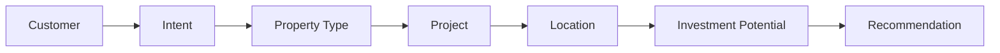

# Aqaar Knowledge Graph Design

## Core Relationship Chain

## Entity Definitions

- Customer: person or organization interacting with Aqaar.
- Intent: extracted objective such as buy, rent, invest, commercial, or support.
- Property Type: residential or commercial asset category.
- Project: Aqaar project, community, or inventory cluster.
- Location: geographic or lifestyle district.
- Investment Potential: derived signal based on location, property type, demand, price band, and liquidity.
- Recommendation: ranked project or unit suggestion with reason and next action.

## Relationship Rules

- Customer HAS_INTENT Intent
- Intent PREFERS_PROPERTY_TYPE PropertyType
- PropertyType AVAILABLE_IN Project
- Project LOCATED_IN Location
- Location HAS_INVESTMENT_SIGNAL InvestmentPotential
- InvestmentPotential DRIVES Recommendation
- Customer HAS_LEAD_SCORE LeadScore
- Conversation UPDATES CustomerProfile
- Recommendation REQUESTS_NEXT_ACTION LeadCapture or Viewing

## Graph Metadata

- Confidence should be stored on every extracted edge.
- Source should be stored on every factual edge.
- Time validity should be stored for price, availability, ROI, and sales claims.
- PII should never be embedded in vector content.
